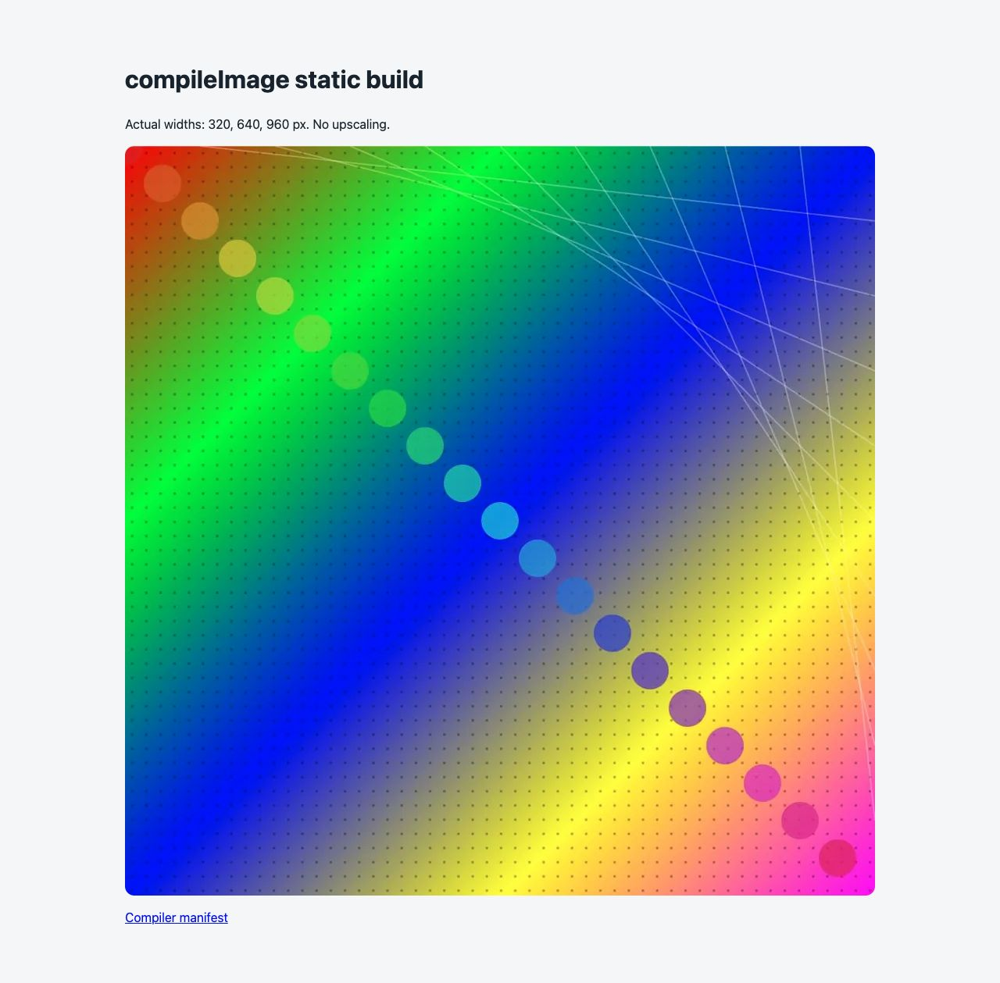
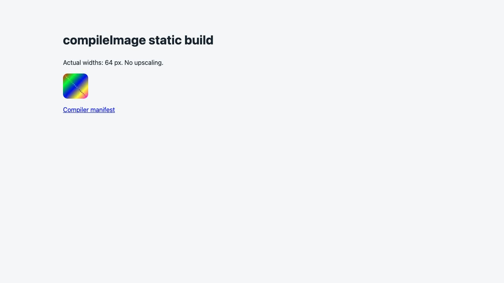
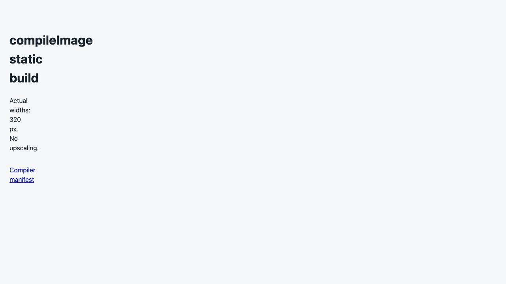

# compileImage 静的サイト導入の技術的再現記録

対象は[#881](https://github.com/albert-einshutoin/lazy-image/issues/881)、#703の子Issue。
画像1件のNode.jsローカルbuildから、manifestを消費する静的ページまでを確認した。
**技術的な再現はPASS。実利用者による採用・市場適合・性能優位は未評価。**
#703全体やROADMAPの「実利用者の導入」まで完了したとは扱わない。

実行例と手順の正本は[導入ガイド](../ADOPTION_GUIDE.md#build-a-static-page-from-the-manifest)。
ここでは実行環境、観測結果と残る制約を保存する。

## 環境と入力の出所

- 開始main: `3251d13dd5db040bdec4a0272855bf7d44ae1a0b`。
- macOS 27.0 / arm64、Node v24.2.0、npm 11.3.0。
- 公開npm `@alberteinshutoin/lazy-image@1.4.3`をcheckout外の空ディレクトリで通常install。
  `npm link`、ローカルtarball、binding差替えなし。実際のmodule/bindingはそのディレクトリの
  `node_modules`内にあることを確認し、version検査も有効にした。
- 入力は既存の`test/fixtures/test_100KB_1057x1057.jpg`（1057×1057、100,055 B）。
  SHA-256: `6dd5004e9cecaaff5a9b315410b0762c4b27b495379f198bfbbfa496464b6f90`。
  [release corpus manifest](../../test/benchmarks/corpus/release-manifest.json)の
  `jpeg-verification-io`はrepository fixture / MITとして収録されている。
  同manifestのLICENSE hashと実ファイルは
  `ff1b6da07c1a09446754bf5e0fe61a788fc6815c0ea0517d385df0b725b2b539`で一致。
  既存fixtureとその派生出力・画面をこの記録に使用した。
- 小画像は同じ入力から公開版`ImageEngine.resize({width:64})`で作った64×64 JPEG。
- ブラウザはmacOS上のCodex In-app Browser。engineの版は取得できずunknownとする。
  [画面とDOM観測](static-site-adoption/browser-display.json)に実URL・読み込み完了・寸法がある。

## 公開版での実行

空であることを確認したtrial directoryで`npm init -y`、続いて以下を実行した。
どちらも終了コード0。install後に同じexample・`_load.mjs`・fixture・LICENSEをコピーした。
package/bindingの版と実hash、入力・補助コードのhash、各コマンドのstdout/stderr/終了コードは
[公開版実行記録](static-site-adoption/published-record.json)、
[npm lock](static-site-adoption/package-lock.json)に保存した。
`baseSha`はcheckoutの開始地点であり、測定した公開packageのsource SHAへ読み替えない。
exampleの実行bytesは`scripts`のSHA-256で固定している。

以下は記録されたCLI操作と、同じ64px派生入力を作るための再現コマンド。
派生入力は実測時にはrecorder内で同じ公開API操作をawaitした。

```bash
npm install --save-exact --registry=https://registry.npmjs.org @alberteinshutoin/lazy-image@1.4.3
mkdir preview-format-review
node compile-image-static-site.mjs input.jpg preview-format-review/normal
node -e "require('@alberteinshutoin/lazy-image').ImageEngine.fromPath('input.jpg').resize({width:64}).toFile('small.jpg','jpeg',80).catch(e=>{console.error(e);process.exitCode=1})"
node compile-image-static-site.mjs small.jpg preview-format-review/small
```

| ケース | コマンド終了 | 成果物・観測 |
|---|---:|---|
| 通常入力 | 0 | 320/640/960px WebP、placeholder、manifest、index.html |
| 小画像 | 0 | 64px WebPだけをsrcsetへ使用。placeholder、manifest、index.html |
| 既存normal出力への再実行 | 1 | build/EEXIST。ページ・画像・manifest全件のhashが実行前後で一致 |
| `not an image`の不正入力 | 1 | preflight/E131。images/とindex.htmlなし |
| width=320 / WebP / maxBytes=1のstrict budget | 1 | processing/E300、causeにtargetBytes未達。images/とindex.htmlなし |
| JPEG/WebPのpicture source順 | 0 | width=320、WebP sourceを先にし、imgはJPEG fallback。ブラウザはWebPを取得 |

負例の終了1は意図した拒否で、正常入力の成功件数に数えない。
strict policyは公開版実行記録の`policies.strict`に保存している。
再実行では以前の出力を残し、常に新しいsite directoryを使った。

## manifestからページ表示まで

```bash
python3 -m http.server 8765 --bind 127.0.0.1 --directory preview-format-review
# http://127.0.0.1:8765/normal/ と /small/ を開く
```

保存した[通常ページ](static-site-adoption/normal/index.html)と
[小画像ページ](static-site-adoption/small/index.html)は、実manifestのartifact path/width/heightから
src/srcset/サイズ指定とplaceholder URLを作ったもの。入力・出力の絶対パスはHTMLに含まれない。
[HTTP検査](static-site-adoption/http-check.json)では全ページ・画像・placeholder・manifestが
200で保存bytes/hashと一致し、invalid/strictの成功ページは404だった。

ブラウザで両ページの画像が表示され、`complete=true`を確認した。
通常ページは`image-960.webp`を960×960で、smallは`image-64.webp`を64×64で表示した。
最終出力のページと画像をブラウザ観測・HTTP検査・保存hashで対応付けている。
PR #882の[format順の指摘](https://github.com/albert-einshutoin/lazy-image/pull/882#discussion_r4238084771)
を受け、sourceはAVIF/WebPを先にし、JPEGをimg fallbackにした。
[追加picture](static-site-adoption/picture/index.html)はJPEG/WebP policyで生成し、
currentSrcが`image-320.webp`、imgのsrcが`image-320.jpg`であることを確認した。
AVIFの追加実測やcodec性能評価は行っていない。通常/64px出力は初回セットと全hashが一致する。







## つまずきとアプリ側実装

- ローカルbindingが1.4.1だった。`npm run build`の初回はSDK 27/linkerの
  `arm64e.x1`不整合で終了1。既存Xcode SDK 26.5を当該コマンドに明示した再試行は終了0で
  native 1.4.3になった。再生成された無関係なloader差分は元へ戻してから検証した。
  永続設定やbuild/CI基盤は変更していない。
- 最初のnpm installは記録用の作業フォルダで実行してしまったため、成功証拠から除外。
  正しい空のtrial directoryで通常installをやり直した。
- strict失敗の外側messageは一般的なprocessing失敗だった。exampleはphase/codeに加えて
  cause・recovery hint・cleanup errorをstderrへ出し、budget未達の原因を確認できるようにした。
  self-testも文言の推測ではなく、実際のstructured phase/codeで拒否を確認する。
- 初版はsmallにも固定960pxの`sizes`を宣言していた。表示自体は64pxだったが、browserの
  density補正後naturalWidthは959だった。実manifestの最大幅とページの表示上限から`sizes`を作り、
  最終版は64pxに一致。小画像のサイズ指定も回帰チェックに含めた。
- アプリ側で必要だったのは、新しいsite directoryの確保、manifest-relative pathからのURL配置、
  srcset/sizesとHTML生成、静的配信。compilerの画像検証・staging・確定処理は再実装していない。

## 検証と制約

```bash
NAPI_RS_ENFORCE_VERSION_CHECK=1 node examples/compile-image-static-site.mjs --self-test
git diff --check
```

最終self-testは終了0、6ケースPASS。生成ファイル・manifest・HTML参照・終了状態を検査し、
compiler内部の呼び出し順を検査していない。実装前の失敗、環境の失敗、初期のassertion失敗は
公開版実行記録の`initialAttempts`へ残した。

今回の公開版実証はmacOS arm64 / Node 24.2.0 / WebP（format選択確認のJPEGを含む）/
入力1件と64px派生入力に限る。
全platform・全入力・全codecの再検証ではなく、v1.4.3の既存公開smokeも再実行していない。
HTMLは画像一式のcommit後にアプリ側で書く。HTML生成失敗時のサイト全体rollback、
複数画像ジョブ、外部storage/CDN、HTTP upload、release/deployは扱わない。
既存サイトを上書きせず、新しい出力先を選ぶ運用を前提とする。
