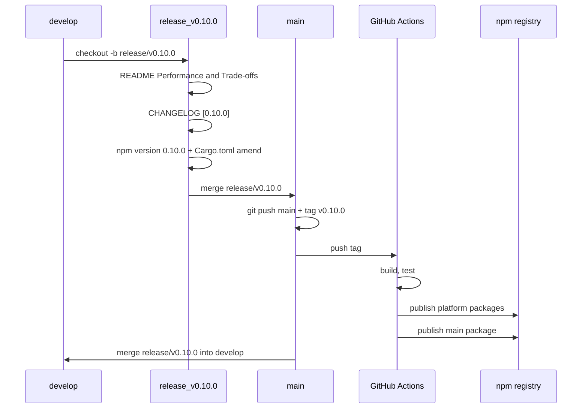

# v0.10.0 リリースプラン

## ブランチ戦略（Git Flow）

このプランは **Git Flow** を前提とする。

- **develop**: 開発のベース。通常の PR は develop にマージする。
- **release/v0.10.0**: develop から分岐。CHANGELOG 更新・バージョン 0.10.0 への更新のみ行う。リリース準備専用。
- **main**: 本番リリース用。release/v0.10.0 を main にマージし、main 上でタグ `v0.10.0` を打って push する。
- **リリース後**: release/v0.10.0 を develop にマージし、develop にバージョン変更を反映する（または main を develop にマージする）。

---

## 現状

- **現在バージョン**: 0.9.0（[package.json](../../package.json) / [Cargo.toml](../../Cargo.toml)）
- **CHANGELOG**: [Unreleased] に v0.10.0 候補の変更が多数記載済み（EXIF 保持、Extract 融合、メトリクス非推奨、processBatch オプションオブジェクト、normalizePixelFormat など）
- **公開トリガー**: タグ `v*` の push または手動 `workflow_dispatch` で [CI の publish ジョブ](../../.github/workflows/CI.yml) が実行され、メインパッケージと 6 プラットフォーム用パッケージが npm に公開される

## リリース手順

### 1. リリース前チェック

- **develop の状態**: リリースに含めたい変更がすべて develop にマージされていること
- **CI**: develop でビルド・テスト・品質ジョブが通っていること
- **CHANGELOG**: [Unreleased] の内容が v0.10.0 として問題ないか最終確認（破壊的変更の有無は [docs/SEMVER_POLICY.md](../SEMVER_POLICY.md) に従う）

### 2. release ブランチを切る

develop から **release/v0.10.0** を分岐する。

```powershell
git checkout develop
git pull origin develop
git checkout -b release/v0.10.0
```

以降の step 3〜5 の作業（README・CHANGELOG・バージョン更新・コミット）は **release/v0.10.0** 上で行う。

### 3. README.md の修正（Performance & Trade-offs）

[README.md](../../README.md) を、提供された **Performance & Trade-offs: lazy-image vs sharp** の内容に基づき修正する。release ブランチ上で実施する。

**置き換え対象**: 既存の **「## 📊 Benchmark Results」**（72行目付近）から **「## ⚡ Features」の直前**（168行目付近）までを、以下の新セクションで置き換える。

**追加する見出しと内容**:

1. **## ⚖️ Performance & Trade-offs: lazy-image vs sharp**
  - 導入文: radical transparency、Cloud-Native efficiency、Linux/x64 ベンチの説明。
2. **### 📊 Benchmark Summary (Large Image 5000x5000px)**
  - 5 行の表（Feature | Metric | lazy-image | sharp | The Verdict）:
    - AVIF Generation: Time — lazy-image 13.3s, sharp 47.4s → Lazy-image ~3.5x Faster
    - JPEG Compression: File Size — lazy-image 1.1 MB, sharp 1.5 MB → ~26% bandwidth save
    - JPEG Encoding: Speed — lazy-image 1.2s, sharp 0.3s → Sharp ~4x Faster
    - Memory Safety: Peak RSS — lazy-image 713 MB, sharp 2,416 MB → ~70% less memory
    - WebP Resize: Speed — lazy-image 320ms, sharp 134ms → Sharp ~2.5x Faster
  - 引用: *Full benchmark data is available in [TRUE_BENCHMARKS.md](../TRUE_BENCHMARKS.md).*
3. **### 🤔 Which one should I choose?**
  - **Choose lazy-image if:** Serverless / Bandwidth / AVIF / Safety の 4 項目（箇条書き）。
  - **Choose sharp if:** Persistent Servers / Throughput / No AVIF の 3 項目（箇条書き）。
4. **### 💡 Our Philosophy**
  - 短文: Slow to encode, Fast to load；最大圧縮率とメモリ安定性を優先。

README の変更を **release/v0.10.0** 上でコミットする（CHANGELOG と同一コミットでも、別コミットでもよい）。

### 4. CHANGELOG を v0.10.0 用に更新

[CHANGELOG.md](../../CHANGELOG.md) を編集する:

- **見出し**: `## [Unreleased]` の直後に `## [0.10.0] - YYYY-MM-DD` を追加（リリース日は作業日または予定日）
- **内容**: これまで [Unreleased] に書いていた v0.10.0 の変更をすべて `[0.10.0]` セクションに移動する
- **Unreleased**: `## [Unreleased]` は空のまま残す（今後の変更用）
- **CHANGELOG 末尾のリンク**（必須）: [CHANGELOG.md](../../CHANGELOG.md) 末尾の Keep a Changelog リンクを更新する。`[Unreleased]: ...v0.9.0...HEAD` を `...v0.10.0...HEAD` に変更し、`[0.10.0]: https://github.com/albert-einshutoin/lazy-image/compare/v0.9.0...v0.10.0` を `[0.9.0]` の直前に追加する

CHANGELOG の変更を **release/v0.10.0** 上でコミットする。

### 5. バージョンを 0.10.0 に上げて同期

**前提**: step 3（README）と step 4（CHANGELOG）の変更はこの前に **コミット済み**にすること。`npm version` は作業ツリーがクリーンである必要がある。

次のいずれかで実施。

**方法 A（推奨）: npm の version コマンド**

```powershell
npm version 0.10.0 -m "Release v0.10.0"
```

- `package.json` の `version` が 0.10.0 に更新される
- `npm version` 実行時に `scripts.version` が走るため、[scripts/sync-version.js](../../scripts/sync-version.js) が実行され、**Cargo.toml**・**package-lock.json**・**optionalDependencies** が 0.10.0 に同期される
- 同時に git で `v0.10.0` タグが作成される（メッセージは上記 `-m` の内容）
- **重要**: `npm version` がコミットに含めるのは **package.json と package-lock.json のみ**（npm の仕様）。`sync-version.js` は **Cargo.toml** も書き換えるが、Cargo.toml は npm が知らないため **自動ではコミットされない**。方法 A を使う場合は **`npm version` の直後に `git status` で確認し、Cargo.toml が変更されていれば `git add Cargo.toml && git commit --amend --no-edit` でコミットに含めてから push すること**。さもないとタグの指すコミットに Cargo.toml の 0.10.0 が含まれず、CI でビルドされる Cargo.toml が 0.9.0 のままになる。
- **lock ファイル**: `sync-version.js` は **package-lock.json** も更新する。package-lock.json は `npm version` によってコミットに含まれる。Cargo.lock は sync-version.js では触らないが、変更があればコミットに含める。

**方法 B: 手動で上げてから同期**

1. [package.json](../../package.json) の `"version": "0.9.0"` を `"0.10.0"` に変更
2. `npm run version` を実行して Cargo.toml / package-lock.json / optionalDependencies を同期
3. コミット後にタグを打つ: `git tag v0.10.0 -m "Release v0.10.0"`

### 6. main にマージしてタグを push（Git Flow）

- リリース用コミットには **package.json / Cargo.toml / package-lock.json** のバージョン変更をすべて含める（方法 A の場合は Cargo.toml の amend を忘れない）。
- **release/v0.10.0** を **main** にマージする。マージは fast-forward でもよいし、`--no-ff` で「Release v0.10.0」のようなマージコミットにしてもよい。
- **main** にチェックアウトし、**main の先頭**にタグ `v0.10.0` があることを確認する（release ブランチで `npm version` した場合はタグは release 側のコミットを指している。main にマージしたあと、main がそのコミットを含んでいればタグは main から参照できる）。
- main とタグを push する。

```powershell
git checkout main
git pull origin main
git merge release/v0.10.0
git push origin main
git push origin v0.10.0
```

**注意**: `npm version` でタグを打った場合、タグは release/v0.10.0 のコミットを指す。そのコミットを main にマージすれば、push するタグは同じコミットを指すので問題ない。

### 7. develop にリリース内容を戻す（Git Flow）

release/v0.10.0 を **develop** にマージし、develop に CHANGELOG とバージョン 0.10.0 の変更を反映する。

```powershell
git checkout develop
git pull origin develop
git merge release/v0.10.0
git push origin develop
```

（main を develop にマージする運用でもよい。いずれにせよ develop の先頭が 0.10.0 の状態になるようにする。）

### 8. CI による公開確認

- タグ `v0.10.0` の push で [.github/workflows/CI.yml](../../.github/workflows/CI.yml) が起動する
- **build** → **test** が成功したあと、**Publish to npm** ジョブが実行される（`if: startsWith(github.ref, 'refs/tags/v')`）
- ジョブ内で 6 プラットフォーム用パッケージ（darwin-x64, darwin-arm64, win32-x64-msvc, linux-x64-gnu, linux-arm64-gnu, linux-x64-musl）が先に公開され、続いてメインパッケージ `@alberteinshutoin/lazy-image` が公開される
- **前提**: GitHub の NPM_TOKEN または Trusted Publisher が設定済みであること

### 9. リリース後の確認

- npm: `npm view @alberteinshutoin/lazy-image version` が `0.10.0` であること
- GitHub: タグ `v0.10.0` から Release を作成する場合は、GitHub の Releases ページで「Draft a new release」→ タグ `v0.10.0` を選び、CHANGELOG の [0.10.0] セクションをコピーして説明文に貼り付けて公開

---

## 注意事項

- **prepublishOnly**: ローカルで `npm publish` を叩くと `napi prepublish --skip-gh-release` が走ります。通常のリリースは CI の publish ジョブに任せるため、ローカルで publish する必要はありません。
- **ブランチ**: 本プランは **Git Flow** を採用し、**release/v0.10.0** でリリース準備を行い、main にマージしてタグを打ったあと develop にマージし戻す流れとする。
- **SEMVER**: v0.9 → v0.10 は MINOR  bump です。[docs/SEMVER_POLICY.md](../SEMVER_POLICY.md) に従い、後方互換の追加・改善のみが含まれていることを確認してください。破壊的変更がある場合は MAJOR にするか、非推奨プロセスを経てから次 MAJOR で削除する方針です。

---

## セルフレビュー・注意点（CI・運用）

### CI トリガーと publish 条件

- **トリガー**: [.github/workflows/CI.yml](../../.github/workflows/CI.yml) は `push`（main / タグ `v*`）、`pull_request`、`workflow_dispatch` で起動する。タグ `v0.10.0` を push するとワークフローが走り、**そのタグが指すコミット**のコードでビルド・テスト・publish が行われる。そのため、タグを打つ前に **そのコミットに package.json / Cargo.toml / package-lock.json / CHANGELOG の 0.10.0 変更がすべて含まれていること**を確認する。
- **publish の needs**: publish ジョブは **build** と **test** にのみ依存している。**quality**（golden / quality-metrics / test:bench:verify）や **supply-chain** / **coverage** / **leak-detection** は publish の条件に入っていない。リリース前に **quality も通っていること**を手動で確認することを推奨する（main または develop で CI がすべて緑であること）。
- **workflow_dispatch**: 手動実行で publish する場合、**実行時点の ref（通常は default ブランチ）のコード**が使われる。タグ push と違って「特定タグのコミット」ではないため、main の package.json が 0.10.0 であることを事前に確認すること。

### ビルド・公開の前提

- **6 プラットフォーム必須**: publish ジョブは `required_platforms`（darwin-x64, darwin-arm64, win32-x64-msvc, linux-x64-gnu, linux-arm64-gnu, linux-x64-musl）がすべて揃っていないと失敗する。build マトリクスのいずれかが失敗するとアーティファクトが欠け、publish が止まる。タグ push 前に **全 6 ビルドが成功している**ことを確認する。
- **認証**: npm 公開には **NPM_TOKEN** または Trusted Publisher（OIDC）がリポジトリに設定されている必要がある。初回や新スコープの場合は [npm Trusted Publishers](https://docs.npmjs.com/generating-provenance-statements) の設定を確認する。

### その他のワークフロー

- **bench.yml / benchmark-regression.yml / fuzz.yml / security.yml**: リリースの **直接のゲートにはなっていない**。CI.yml の build / test / publish が通ればリリースは可能。必要に応じてベンチやセキュリティチェックも実行済みであることを確認するとよい。

### コミットに含めないもの

- **npm/**、**\*.node**、**target/**、**node_modules/**、**artifacts/** は [.gitignore](../../.gitignore) で除外されている。リリース用コミットにこれらを add しないこと（通常の `git add` では入らない）。

### 推奨手順の要約（Git Flow）

1. develop から **release/v0.10.0** を切る。
2. release/v0.10.0 上で **README.md** を Performance & Trade-offs セクション（表・Which one / Philosophy）で更新してコミット。
3. 同ブランチで **CHANGELOG** を [0.10.0] に更新（本文＋末尾リンク）してコミット。
4. 同ブランチで `npm version 0.10.0 -m "Release v0.10.0"` 実行後、**必ず `git status` で Cargo.toml の変更を確認し、あれば `git add Cargo.toml && git commit --amend --no-edit`**。
5. **main** に release/v0.10.0 をマージ → `git push origin main` → `git push origin v0.10.0`。
6. **develop** に release/v0.10.0 をマージして push。

## 作業フロー概要（Git Flow）


